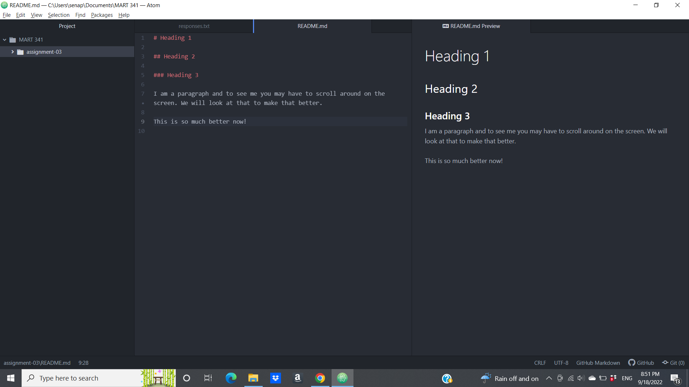

# README

1. I may have had exposure to Markdown, but until now I would have never been able to identify it as such, so properly learning it in this class was new for me.
2. I never knew the inner-workings of the internet, as I was very much someone that had taken it for granted, so it was very interesting to take a moment to learn about the process.
3. I didn't actually know what the letters in most (if not all) of the acronyms like PNG or HTML actually stood for, so a few of them were surprises that they actually made a lot of intuitive sense.

[My Responses](./responses.txt)

