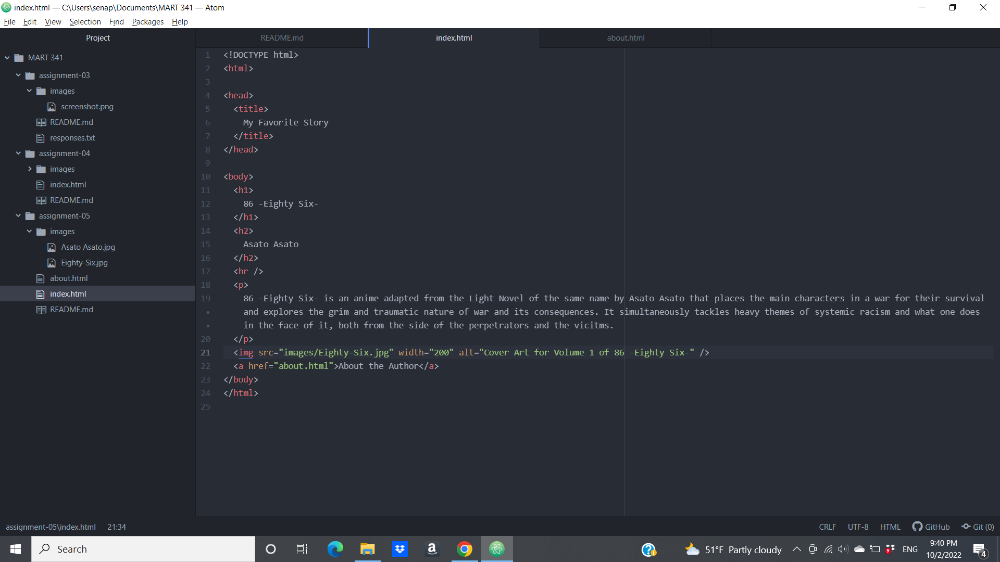

1. I decided to check out YouTube and chose a date in March of 2015. One of the interesting differences I found was that the icon in the tab for YouTube in the 2015 version is a darker red color than the current one, as well as having a larger triangle in the box. In terms of overall design, I was surprised to see that while many of then elements looked different stylistically, there was a lot of overlap at a fundamental level. Both still have a "What to watch" section that is front and center that displays trending videos, however the 2015 version showcases specific channels and their videos verses the current version that just pushes popular videos. Also, the 2015 version has some empty space around its presentation of videos, whereas the current version fills out the entirety of the space
Both have an options bar on the left side of the screen that has all of the different categories that both refer to as "The Best of YouTube." The final overall difference I noticed is that the 2015 version just gives the creators name under the video title, but the current version also includes the channels profile picture next to their name. 

2. 
