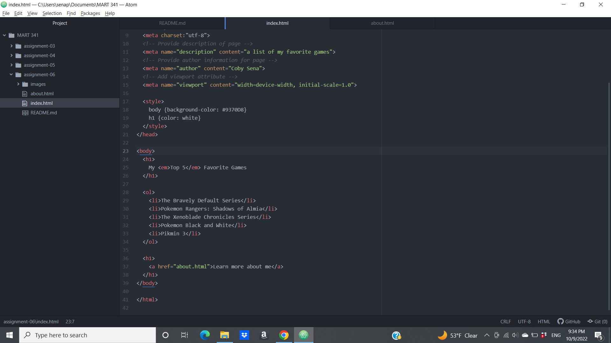

1. Structural Markup is what is used to actually place and embed information into a page or site and is used to guide a user through the content, whereas Semantic Markup is used to emphasize key parts of the content or to provide additional information that assists in providing a meaning to the content.

2. 
