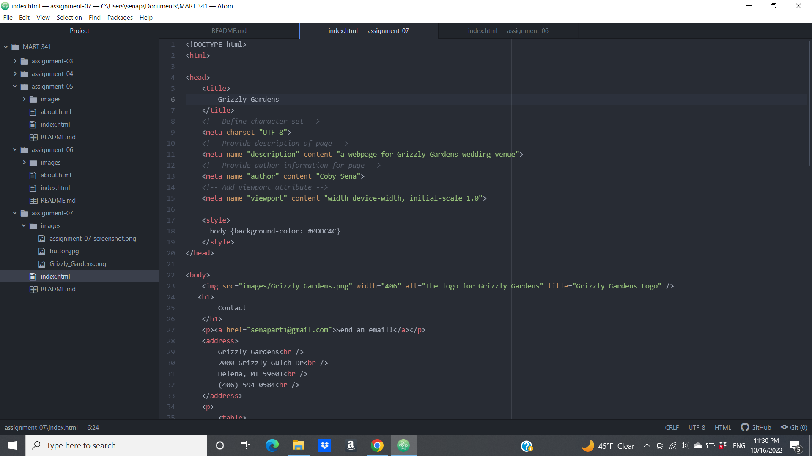

1. I am most familiar with web forms on the internet for buying some kind of product or service and having to enter my billing information, which can include a checkbox for type of payment (like Debit, Credit or PayPal), text entries, and password input (usually for the CVV). The next web form that I'm most familiar with is submission forms for Moodle for turning in assignments.\

2. 
