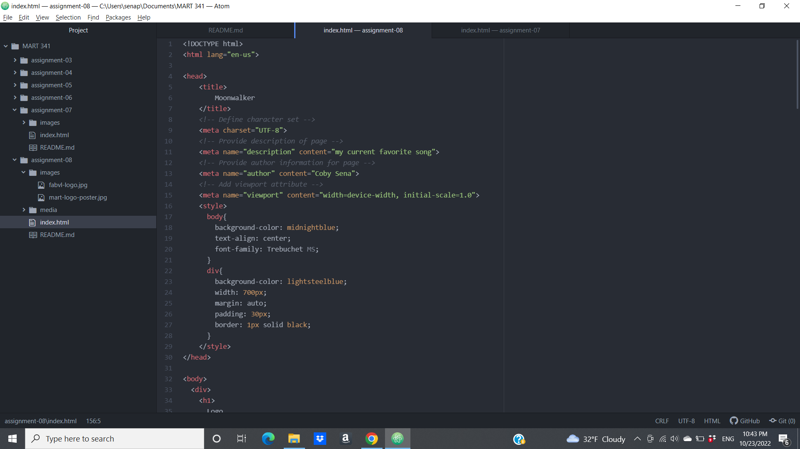

1. An affordance is the property of some kind of object on a website that presents a prompt to interact with it by a user.

2. The advantages of using a third-party service to host videos is that they can host large, high quality versions of file as well as handle a lot of the necessary work to play the media on a variety of browsers. The disadvantages are that unlicensed material can be reported and taken down as well as it being costly to upgrade storage and/or services.

3. 
