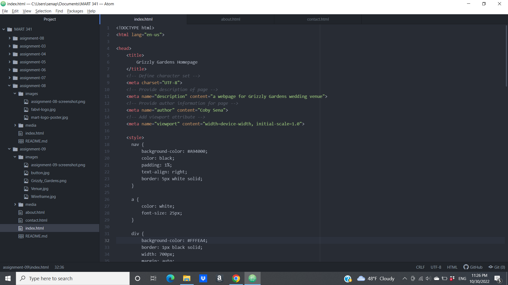

1. I had done some work in making websites and other coding endeavors, but those were all awhile ago, so it was interesting to have a refresher in HTML. There were some things that were unfamiliar to me, like the &ltdiv&gt elements and iframes, so it was cool to have something new to learn as well.

2. The basic structure of HTML was fairly familiar to me, so getting back into it was not much of a challenge, but I do not believe I have much experience with CSS, so I'm somewhat nervous that there will be a sudden increase in difficulty for me personally, but I still think that there will be some cool things to learn if I can get past the initial shock.

3. 
