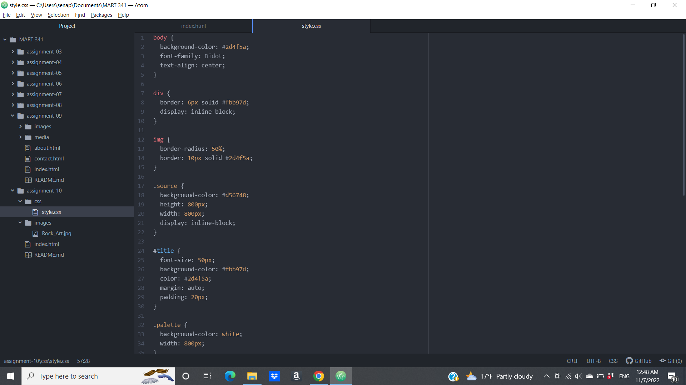

1. A Universal Selector, or the *, is used to style everything in the page. The Element Selector is used to style all elements of a certain type. The Class Selector is used to select and style elements that serve the same function by targeting the class attribute. The ID Selector is used to select and style elements by calling its ID with #. These selectors get more specific as you go, so if you wanted to make targeted changes to something, but leave everything else untouched, you may use an ID or Class selector, depending on which is more appropriate, for fine tuning.

2. To pick my palette, I took my image and used a color picker site to get the hex codes for 4 colors from the image itself that I thought best represented the range of colors on the art piece. I noticed after the fact that this was a somewhat split complimentary color scheme.

3. 
