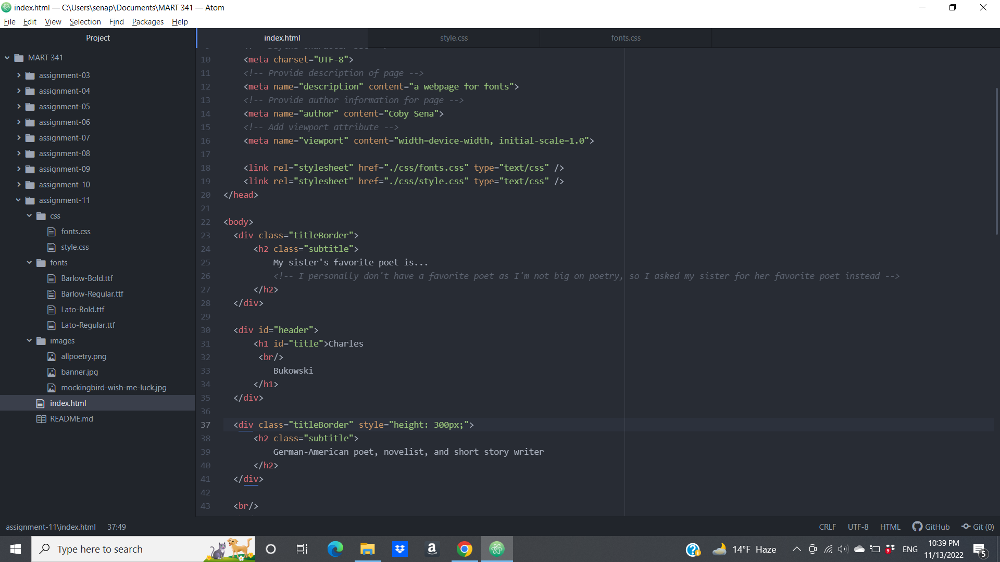

1. Typography is both the art and science of making and arranging letters and words to make them visually appealing and legible.

2. Having fallback fonts or a font stack allows for you to be able to control the back-up fonts that a browser will load in the event that it is unable to load the primary choice for your font.

3. A system font is a font that is already installed on your local device or system, a web font is a font that is custom made and hosted on a server, and a web-safe font is a font that is assumed to already be available on the vast majority of systems. 

4. 
