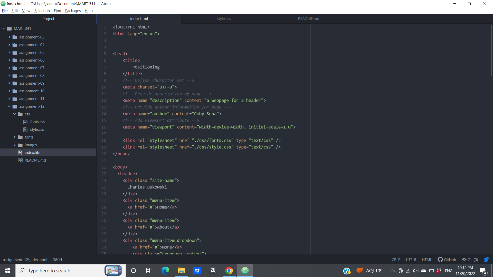

1. Padding is how much space there is between the content of the content inside the element and the element itself. The Margin is how much space there is between the element and other elements in the page. Borders are visible barriers between content to separate them visually from each other.

2. I had the weirdest experience with working with the css code. For whatever reason, I couldn't get the header element selector to work for me, and therefore subsequent element and class selectors wouldn't work either. Atom wasn't highlighting the header selector red, so I knew it was that specific selector that was giving me trouble. After googling my problem and searching for answers to no avail, I started playing around with the other element selectors in the stylesheet. Then, I noticed that Atom would give me prompts to auto-complete the selector if it could tell what I wanted. The funny thing is, it would auto-complete the header selector properly at the beginning of the stylesheet, but it wouldn't in the middle or end. So, I moved the header element selector to the top and suddenly it worked. But then, the next class selector broke and the orange text was de-highlighted and it wouldn't worked. So I moved it to the beginning again like I did before and it fixed itself, except the next class selector broke immediately. So, I decided to move everything to the beginning, and it all fixed itself. I still have no idea why that worked or even why it caused a problem in the first place, but I'm just glad that it's resolved. 

3. 
